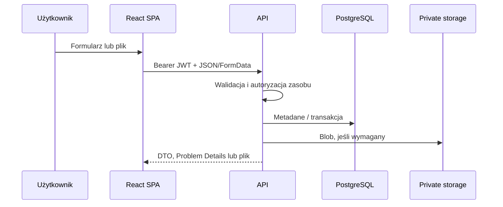

# Przepływ danych

```mermaid
sequenceDiagram
  participant U as Użytkownik
  participant F as React SPA
  participant A as API
  participant D as PostgreSQL
  participant S as Private storage
  U->>F: Formularz lub plik
  F->>A: Bearer JWT + JSON/FormData
  A->>A: Walidacja i autoryzacja zasobu
  A->>D: Metadane / transakcja
  A->>S: Blob, jeśli wymagany
  A-->>F: DTO, Problem Details lub plik
```

Operacje plik + baza mają kolejność i kompensację zależną od modułu. Sekret z sejfu nie jest zwracany na listach; ujawnienie generuje zdarzenie audytowe bez wartości sekretu.
