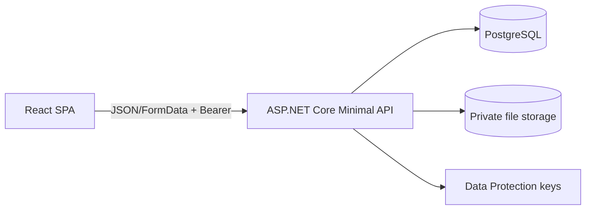

# Przegląd architektury

System składa się z frontendowego SPA React/Vite, backendu ASP.NET Core 10 Minimal API, PostgreSQL oraz prywatnego storage plików. Uwierzytelnianie wykorzystuje JWT Bearer, a uprawnienia są wyliczane dla użytkownika, organizacji i zasobu.

Warstwa `Application` zawiera przypadki użycia, `Domain` encje i DTO, `Infrastructure` dostęp do danych oraz bieżącego użytkownika, a `Api` grupy endpointów funkcjonalnych.
