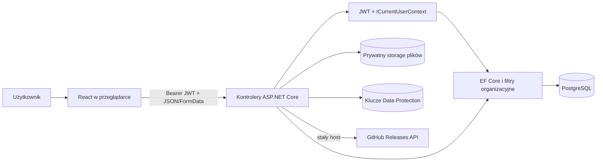

# Architektura przed refaktoryzacją

## Podział odpowiedzialności

Backend jest monolitem warstwowym tylko częściowo. `Program.cs` pełni composition root. Kontrolery zawierają zarówno orkiestrację HTTP, jak i znaczną część logiki biznesowej. `Application` zawiera usługi techniczne (JWT, hashing, Data Protection, storage, GitHub i inicjalizacja), `Infrastructure` zawiera EF i kontekst autoryzacji, a `Domain` encje, DTO i mapowania. Nie ma repozytoriów ani spójnej warstwy przypadków użycia.

Frontend jest SPA komponentową. `AuthContext` zarządza sesją, `AppProvider` organizacją i dostępem, `src/api` komunikacją, a duże komponenty ekranowe zawierają logikę formularzy i prezentacji. `PermissionGate` jest wyłącznie kontrolą UX; rzeczywista autoryzacja jest po stronie API.

## Przepływ danych

Granice zaufania: przeglądarka/API, API/baza, API/storage i klucze, API/GitHub oraz reverse proxy/API. Szczególnie wrażliwe są token bearer w przeglądarce, identyfikatory organizacji/zasobów w URL, zawartość uploadów i klucze Data Protection.

## Autoryzacja

`OrgScopedController` mapuje nazwę kontrolera na nazwę zasobu. `DbCurrentUserContext` oblicza dostęp z członkostwa, roli niestandardowej lub reguł klienta. Globalne filtry EF dla `BaseEntity` wymuszają członkostwo i uprawnienia odczytu; akcje zapisu wykonują dodatkowe sprawdzenie. Prywatne notatki mają filtr użytkownika. Diagram i dashboard, które nie dziedziczą po `BaseEntity`, sprawdzają organizację jawnie.

Model jest zasadniczo deny-by-default dla ról niestandardowych i klientów, lecz jest złożony i zależny od zgodności: nazwa kontrolera → nazwa modułu → filtr EF → jawny check. Testy pokrywają wiele scenariuszy BOLA/IDOR, ale nie pełny middleware ani rzeczywisty provider PostgreSQL.

## Sesja

JWT HS256 zawiera `sub`, e-mail, rolę systemową i `jti`, bez identyfikatora sesji/wydania. Token ma 8 godzin, brak refresh tokena i serwerowego unieważniania. Wylogowanie usuwa token wyłącznie z `localStorage`. Zablokowanie konta, zmiana roli i hasła nie unieważniają wydanego tokena; rola administratora w claimie pozostaje ważna do wygaśnięcia.

## Pliki i dane poufne

Storage generuje losowy prefiks i używa `Path.GetFileName`, a pliki są poza katalogiem publicznym. API ufa jednak deklarowanemu MIME, nie ma allowlisty typów, sygnatur, kwarantanny ani skanowania malware. Treść może być renderowana inline. Frontend parsuje DOCX/XLSX, a XLSX jest zamieniany na HTML i wstawiany przez `dangerouslySetInnerHTML`.

Wpisy sejfu są szyfrowane Data Protection. Klucze są trwałe, ale nie są chronione certyfikatem/KMS. Klucze licencyjne są przechowywane jawnie. Wrażliwe sekrety konfiguracyjne znajdują się obecnie w śledzonym `appsettings.json` i przykładowym compose.

## Słabe sprzężenia architektoniczne

- Logika biznesowa i walidacja są rozproszone w kontrolerach.
- Większość DTO nie ma ograniczeń długości/zakresu.
- Brak centralnego mapowania wyjątków do Problem Details.
- Brak audytu zdarzeń bezpieczeństwa i identyfikatora korelacji.
- Automatyczna migracja przy każdym starcie łączy uprawnienia runtime i schema-owner.
- Testy bez hosta HTTP nie wykrywają błędnej kolejności middleware, nagłówków, limitów ani kontraktu serializacji.

