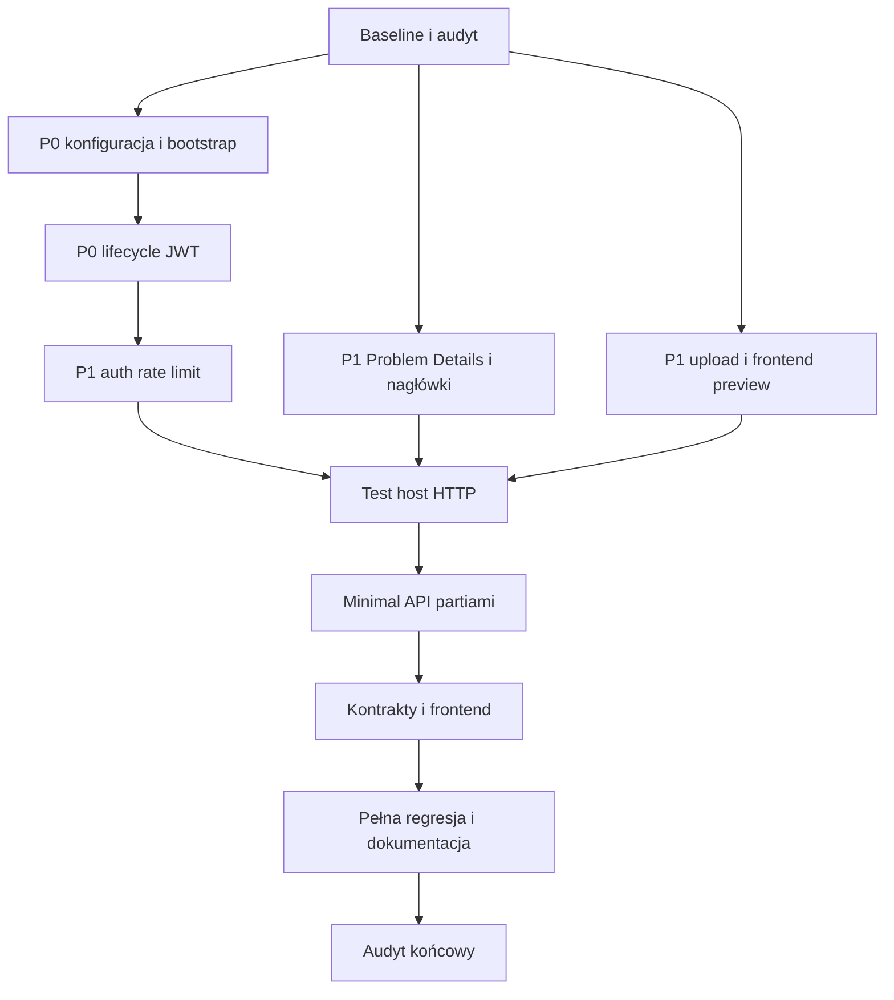

# Plan implementacji i migracji

## Zależności

## Partie Minimal API

Migracja zachowa ścieżki i kształty DTO. Logika będzie najpierw wydzielana z kontrolera, jeżeli jest złożona; definicje endpointów pozostaną cienkie.

1. Version i Auth (**zakończone**) — hardening sesji wykonano przed migracją, a walidację Minimal API pokrywa wspólny filtr i test hosta.
2. Proste moduły CRUD: assets, contacts i groups (**zakończone**), następnie incidents, knowledge, licenses i plans.
3. Projekty/tasks i subnets/IP — zależności między zasobami.
4. Contracts/warranties/files — storage, multipart i streaming.
5. Dashboard/diagram/passwords/private notes/reports.
6. Organizations, roles, clients i admin — najbardziej wrażliwa autoryzacja, migrowana po pełnych testach HTTP.

Każdy moduł otrzyma grupę endpointów w osobnym pliku funkcjonalnym, wymaganie autoryzacji na grupie, jawne typy wejścia/wyjścia i wspólne mapowanie błędów. Stary kontroler zostanie usunięty dopiero po teście zgodności wszystkich jego tras.

## Priorytety

- **P0:** SEC-001–003; rotacja ujawnionych sekretów jest obowiązkiem operatora.
- **P1:** SEC-004–010 oraz audyt i zależności.
- **P2:** walidacja, limity, test hosta, migracja Minimal API i uporządkowanie usług.
- **P3:** optymalizacja bundle, dokumentacja, CI/SBOM, ostrzeżenia kompilatora i porządkowanie jakościowe.

## Warunki brzegowe

- Bez destrukcyjnych migracji i bez zmiany istniejących danych produkcyjnych.
- Addytywne migracje muszą mieć bezpieczną wartość dla istniejących rekordów.
- Nie zmieniać UX ani publicznego API bez udokumentowanej potrzeby.
- Po każdej partii: backend tests, frontend tests/build, `git diff --check`, aktualizacja `implementation-progress.md`.
